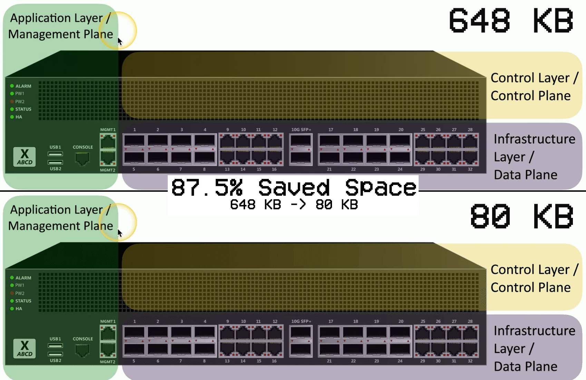

# 🖼️ Obsidian Image Organizer

This vibe-coded script will **organize** your Obsidian vault. Instead of having every pasted image dumped in the root directory, it will be moved into an `assets/` folder next to the note that references it.

It will also **compress** all PNG images (optional) to save space! Since they are all screenshots, why would you keep the full resolution?

---

## 📌 Problem Statement

I use [Obsidian](https://obsidian.md/) for note-taking, and I often paste screenshots directly into my notes (such as diagrams, UI references, and quick visuals). By default, Obsidian saves all pasted images to the **root of the vault**, which quickly becomes messy and unorganized.

This causes two main issues:
- It’s hard to **share or move a specific note** without also manually locating and bundling its pasted images.
- The images — especially full-resolution screenshots — tend to be **unnecessarily large in size**, which bloats the vault and slows syncing.

To solve this, I created this script:
- It **automatically organizes pasted images** by moving them into an `assets/` folder placed next to each note, so every note becomes self-contained and easy to share.
- It **automatically compresses PNG images** to reduce file size while keeping acceptable quality.
- It **keeps track of previously compressed images** to avoid recompressing.
- I run it daily via `crontab` to **keep my vault clean and lightweight** without manual effort.

## 📁 Example

### Before

```
ObsidianVault/
├── diagram.png
├── screenshot.jpg
├── meeting-notes.png
├── Projects/
│   ├── 2025 AI Project.md         ← contains ![[diagram.png]]
│   └── team-sync.md              ← contains ![[meeting-notes.png]]
├── Notes/
│   └── daily-log.md              ← contains ![[screenshot.jpg]]
```

### After

```
ObsidianVault/
├── Projects/
│   ├── 2025 AI Project.md
│   ├── team-sync.md
│   └── assets/
│       ├── diagram.png
│       └── meeting-notes.png
├── Notes/
│   ├── daily-log.md
│   └── assets/
│       └── screenshot.jpg
```

### Compression Result and a Comparison




---

## ⚙️ How it works

- It scans all `.md` files in your vault (recursively)
- Finds embedded image links like `![[image.png]]`
- Moves the actual image file (if found in the root) to a local `assets/` folder next to the note
- Creates logs of every operation in `.logs/`
- Optionally compresses `.png` images without affecting quality
- Skips already compressed or moved images using hashing

---

## 🛠️ Usage

```bash
node script.js [VAULT_PATH] [RUN_MODE] [OPTIONS]
```

### Parameters

| Argument | Description |
|----------|-------------|
| `VAULT_PATH` | Path to your Obsidian vault |
| `RUN_MODE` | One or more: `--move-images`, `--compress-images` |
| `OPTIONS` | Optional flags for more control |

---

## ⚙️ Command Line Options

### Run Modes _(Can be combined)_

- `--move-images` – Move embedded images to `assets/` next to each note
- `--compress-images` – Compress PNGs recursively (logs and skips already compressed ones)
- `--print-report` – Generate and prints a report based on the contents of `.logs/` files.

### Optional Flags

- `--skip-vault-checking` – Skip the check for `.obsidian/` folder
- `--skip-not-found` – Ignore warnings about missing images
- `--only-actions` – Only log actual actions (cleaner logs)

---

## Example Commands

```bash
node script.js "/path/to/ObsidianVault" --move-images # To just organize the images
node script.js "/path/to/ObsidianVault" --compress-images # To just compress the .PNGs
node script.js "/path/to/ObsidianVault" --move-images --compress-images --only-actions --skip-not-found
```

---

## 🗃️ Logs

All actions and warnings are logged inside your vault:

```
ObsidianVault/.logs/
├── obsidian-image-organizer-logs.log
├── moved-images.json
└── compressed-images.json
```

- `obsidian-image-organizer-logs.log`: Human-readable log of everything done
- `moved-images.json`: All image move actions with timestamp
- `compressed-images.json`: All compression records with size change and hash

You can print a report and get statistics of these file:

```bash
node script.js "/path/to/ObsidianVault" --print-report
```

```
📊 Obsidian Image Organizer Report
----------------------------------
🗜️  Compressed Images: 2499
📦  Original Size: 334.45 MB
📉  Compressed Size: 89.38 MB
💾  Space Saved: 245.08 MB (73.28%)
🕐  First Compression: 2025-06-13 15:19:57
🕓  Last Compression:  2025-06-15 21:00:03

📁 Moved Images:  104
🕐  First Move: 2025-06-13 15:19:56
🕓  Last Move:  2025-06-15 21:00:02

🏆  Biggest Save:
    🔹 File: ***
    📦 Old Size: 3.68 MB
    📉 New Size: 813.10 KB
    💾 Saved: 2.89 MB (78.44%)

📘 Script Runs:  14
⏲️  Last Run Duration: 0.03 sec
⏱️  Average Duration: 27.74 sec
🕓  Last 3 Runs: 2025-06-15 21:00:01, 2025-06-16 00:13:29, 2025-06-16 00:30:43
```

---

## ⚙️ Automation

You can run this script daily with `cron` to keep your vault clean:

```bash
0 0 * * * node /path/to/obsidian-image-organizer/script.js "/path/to/ObsidianVault" --move-images --compress-images --only-actions --skip-not-found --skip-vault-checking
```

